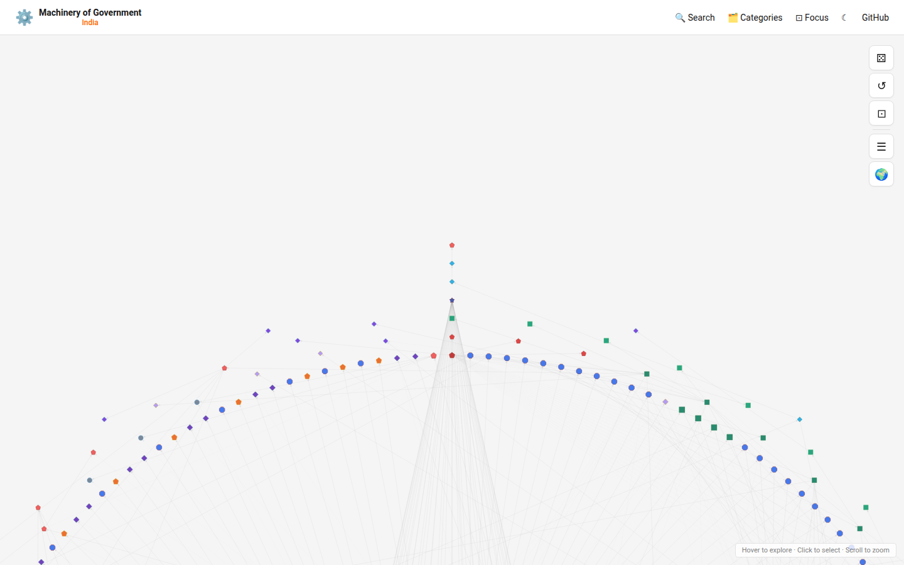

# Machinery of Government - India 🇮🇳

An interactive web application for exploring the structure of the Indian Government — showing how ministries, departments, constitutional bodies, regulatory authorities, and public sector organizations relate to and oversee one another.



## Features

### Views

**Full View (default)** — Every element in the network is shown simultaneously, arranged in concentric rings by constitutional distance from the President:

- Ring 0 — President
- Ring 1 — Vice President, Prime Minister
- Ring 2 — Cabinet Ministers
- Ring 3 — Union Ministries
- Ring 4 — Departments, Agencies
- Ring 5+ — Bodies, PSUs, Tribunals

**Focus View** — The selected element is placed at the centre with its parents and children arranged radially.

### Navigation & Visualization

- **Interactive network graph** — click any node to select it; connections arranged radially in focus view
- **Element pane** — detailed sidebar with tabbed sections for Info, Powers, Budget, and Staff
- **Random element** — ⚄ button jumps to a randomly selected element
- **Legend** — color-coded key for element categories
- **Search pane** — full-text and tag-based search across all elements
- **Dark / Light mode** — toggle between appearances

### Element Detail Tabs

**Info**
- Description, role title, current role holder
- Jurisdiction (Union, State, UT)
- Clickable tag pills (type and sector)
- All parent and child relationships, grouped by relationship type
- Link to official website

**Powers** (Coming Soon)
- Constitutional powers and duties
- Statutory functions
- Allocation of Business Rules entries
- Links to legislation

**Budget** (Coming Soon)
- Budget Estimates (BE) and Revised Estimates (RE)
- Actual expenditure
- Breakdown by plan/non-plan

**Staff** (Coming Soon)
- Sanctioned vs. actual strength
- Grade-wise breakdown (IAS/IPS/IFS, Group A/B/C)

### Classification System

| Category | Subtypes |
|----------|----------|
| **Official** | President, Vice President, Prime Minister, Cabinet Minister, Minister of State (IC), Minister of State, Deputy Minister, Governor, Chief Minister, Civil Servant, Constitutional Official |
| **Ministry** | Union Ministry, Department, Attached Office, Subordinate Office, Field Office |
| **Body** | Constitutional Body, Statutory Body, Regulatory Authority, PSU, Autonomous Body, Tribunal, Commission, Authority, Corporation |
| **Group** | Cabinet, Cabinet Committee, Council, Commission Group, Task Force |

### Tag System

Each element can carry:
- **Type tags**: Regulator, PSU, Tribunal, Commission, Authority, Research Institution, Training Institution, Advisory Body
- **Sector tags**: Finance, Defence, Home Affairs, External Affairs, Health, Education, Infrastructure, Agriculture, Commerce, Technology, Environment, Social Justice, Law, Energy, Transport

### Jurisdiction System

```
Union (Central)
├── States (28)
│   └── Individual states...
└── Union Territories (8)
    ├── With Legislature (Delhi, Puducherry, J&K)
    └── Without Legislature (5 others)
```

## Data Coverage

### Current Coverage (`src/data/elements.ts`)

- **Constitutional Officials**: President, Vice President, Prime Minister
- **Cabinet Ministers**: Home Affairs, Finance, External Affairs, Defence, Law & Justice, Health, Education, Agriculture, Commerce, Railways, Petroleum
- **Cabinet Committees**: CCS, CCEA, CCPA
- **Union Ministries**: 12+ major ministries with departments
- **Constitutional Bodies**: Supreme Court, Election Commission, CAG, UPSC, Finance Commission, Attorney General
- **Regulatory Bodies**: RBI, SEBI, IRDAI, TRAI, NITI Aayog
- **Major PSUs**: ONGC, IOC, SBI, Indian Railways, BHEL
- **Tribunals**: NGT, NCLT, CAT

### Planned Additions

- All 52+ Union Ministries
- All remaining Cabinet and State Ministers
- State Governments structure
- Comprehensive PSU database
- Budget data from Union Budget documents
- Staff data from DoPT Annual Reports
- Powers data from Allocation of Business Rules

## Tech Stack

- **React 18** + **TypeScript** via **Vite 5**
- **Cytoscape.js** — network graph visualization
- **Recharts** — budget and staff charts (coming soon)
- **CSS3** — component-scoped styling with CSS custom properties

## Getting Started

### Prerequisites

Node.js 18+ and npm.

### Installation

```bash
npm install
```

### Development

```bash
npm run dev        # http://localhost:5173
```

### Production Build

```bash
npm run build      # outputs to dist/
npm run preview    # preview the production build locally
```

## Project Structure

```
src/
├── components/
│   ├── FullView.tsx / .css         # Full view — Cytoscape concentric layout
│   ├── ElementDetails.tsx / .css   # Element detail pane (Info / Powers / Budget / Staff)
│   ├── Header.tsx / .css           # Top navigation bar
│   └── SearchPane.tsx / .css       # Search and filter pane
├── data/
│   ├── elements.ts                 # All government element data and tag definitions
│   └── jurisdictions.ts            # Jurisdiction types and hierarchy
├── types/
│   └── index.ts                    # TypeScript type definitions
├── utils/
│   └── colors.ts                   # Element color scheme
├── App.tsx                         # Main app, state management, dark mode
├── App.css                         # Layout, responsive breakpoints
├── index.css                       # Global styles, CSS variables
└── main.tsx                        # React entry point
```

## Data Structures

### GovElement (`src/data/elements.ts`)

```typescript
{
  id: string                   // unique identifier (kebab-case)
  name: string                 // display name
  nameHindi?: string           // Hindi name
  abbreviation?: string        // common abbreviation
  category: 'official' | 'ministry' | 'body' | 'group'
  subtype: string              // see classification system
  description: string
  role?: string                // role title (officials only)
  currentHolder?: string       // person currently in the role
  parentIds: string[]          // elements this reports to
  secondaryParentIds?: string[] // additional oversight relationships
  tags?: string[]              // tag IDs
  jurisdictions?: Jurisdiction[]
  legalBasis?: string          // constitutional article or act
  infoUrl?: string             // official website
  headquarters?: string
  establishedYear?: number
}
```

## Data Sources

| Data Type | Source |
|-----------|--------|
| Government Structure | [india.gov.in](https://india.gov.in), Ministry websites |
| Budget | [indiabudget.gov.in](https://www.indiabudget.gov.in) |
| Civil Service Stats | DoPT Annual Reports |
| Constitutional Powers | Constitution of India, Allocation of Business Rules |
| PSU List | Department of Public Enterprises |
| Regulatory Bodies | Respective ministry websites |

## Contributing

Contributions are welcome! Please see [CONTRIBUTING.md](CONTRIBUTING.md) for guidelines.

### Adding New Elements

1. Add entry to `src/data/elements.ts`
2. Ensure `parentIds` correctly reference existing elements
3. Add relevant tags from `tagDefinitions`
4. Run `npm run dev` to verify the element appears correctly

### Adding Powers Data

Add entry to `src/data/powers.ts` (coming soon) with references to:
- Constitutional articles
- Relevant Acts
- Allocation of Business Rules entries

## Disclaimer

The information in this application is provided for general reference purposes only. While every effort has been made to ensure accuracy, the data may be incomplete, incorrect, or out of date. Government structures, ministerial appointments, and organizational relationships change frequently. Always verify against official sources such as [india.gov.in](https://india.gov.in).

## License

MIT License - see [LICENSE](LICENSE) for details.

## Acknowledgments

- Inspired by [Machinery of Government UK](https://machineryofgovernment.co.uk) by Harry Rushworth
- Data sourced from Government of India official publications
- Built with [Cytoscape.js](https://js.cytoscape.org/)

---

Made with ❤️ for understanding Indian governance
