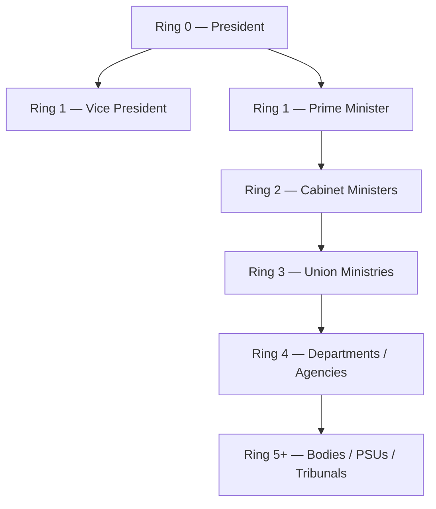
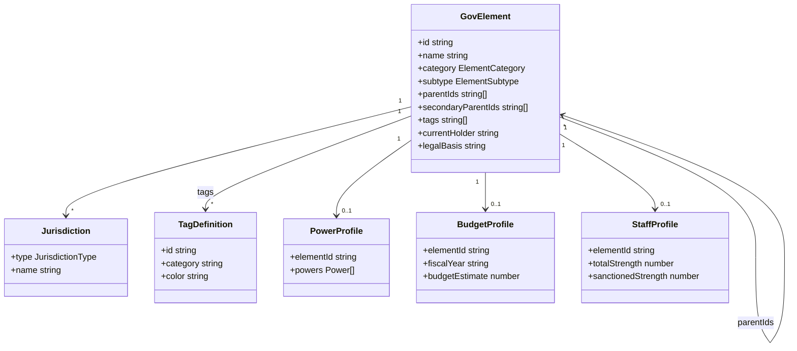
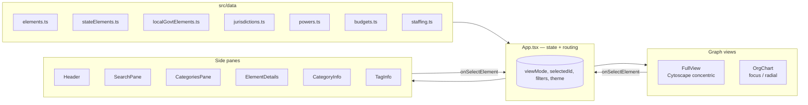

# Machinery of Government — India 🇮🇳

[](LICENSE)
[](package.json)
[](https://react.dev)
[](https://www.typescriptlang.org)
[](https://vitejs.dev)

Interactive visualization of the Indian Government — ministries, departments, constitutional bodies, regulators, tribunals, and PSUs, and how they oversee one another.

> **Live demo:** [vtri950.github.io/MoG-India](https://vtri950.github.io/MoG-India/)


## What it shows

The Indian state is modelled as a network of **elements** (officials, ministries, bodies, groups) connected by **oversight relationships**. Distance from the President roughly corresponds to constitutional remoteness.



Two views render this network:

- **Full view** — every element placed in concentric rings (Cytoscape).
- **Focus view** — the selected element at the centre, with parents and children radiating outward.

## Features

- Click any node to open its **details pane** (Info, Powers, Budget, Staff tabs)
- **Search** by name, abbreviation, or tag
- **Filter** by category, jurisdiction (Union / State / UT), or tag
- **Random element** button (⚄) for serendipitous browsing
- **Dark / light** theme
- **Legend** and **territory filter** popovers

> Powers, Budget, and Staff tabs render scaffolds today — the underlying data files (`powers.ts`, `budgets.ts`, `staffing.ts`) are works in progress.

## Interacting with the graph

| Action | Result |
|--------|--------|
| **Click** a node | Selects it; opens the details pane |
| **Click** the selected node again | Switches to **Focus view** — element centred, parents and children arranged radially |
| **⊡ / ⊞** toolbar button | Toggle between Full view and Focus view |
| **↺** toolbar button | Reset selection, clear filters, re-centre graph |
| **⚄** toolbar button | Jump to a randomly selected element |
| **☰** toolbar button | Toggle the legend (node shapes + edge styles) |
| **🌍** toolbar button | Filter graph by jurisdiction (Union / State / UT) |
| Click a **tag pill** in the details pane | Opens the tag info pane — shows all elements with that tag |
| Click a **category chip** in the details pane | Opens the category info pane — shows all elements of that type |
| Click a **parent or child link** in the details pane | Navigates directly to that element |
| **Search pane** (header) | Full-text search across name, abbreviation, and description; filter by category or tag |

### Edge styles

| Style | Meaning |
|-------|---------|
| Solid line | Primary relationship — element **reports to** / is **part of** its parent |
| Dashed line | Secondary relationship — **oversight**, **advisory**, or **coordinate** link |

## Relationships

Every element has one or more parent elements, encoded as two arrays on `GovElement`:

| Field | Edge style | Meaning |
|-------|-----------|---------|
| `parentIds` | Solid | Primary hierarchy — "reports to" / "is part of" |
| `secondaryParentIds` | Dashed | Secondary link — oversight, advisory, or coordination |

The full set of `RelationshipType` values used in the data:

| Type | Example |
|------|---------|
| `reports-to` | Ministry → Cabinet Minister |
| `part-of` | Department → Ministry |
| `overseen-by` | PSU → Ministry (secondary) |
| `advises` | NITI Aayog → Prime Minister |
| `appoints` | President → Governor |
| `coordinates-with` | Inter-ministry coordination body |

In the graph, the **direction** of an edge always points from child to parent (i.e., arrows indicate "reports to", not "controls").

## Domain model

Every node is a `GovElement`. Elements carry classification (category + subtype), tags, jurisdictions, and one or more parent links.



### Classification

| Category | Subtypes |
|----------|----------|
| **Official** | President, Vice President, PM, Cabinet Minister, MoS (IC), MoS, Deputy Minister, Governor, CM, Civil Servant, Constitutional Official |
| **Ministry** | Union Ministry, State Ministry, Department, Attached/Subordinate/Field Office |
| **Body** | Constitutional, Statutory, Regulatory, PSU, Autonomous, Tribunal, Commission, Authority, Corporation, Society, Trust, Local Body, Service Cadre |
| **Group** | Cabinet, Cabinet Committee, Council, State Legislature, Commission Group, Task Force |

### Tags

- **Type** — Regulator, PSU, Tribunal, Commission, Authority, Research/Training Institution, Advisory Body
- **Sector** — Finance, Defence, Home, External Affairs, Health, Education, Infrastructure, Agriculture, Commerce, Tech, Environment, Social Justice, Law, Energy, Transport

### Jurisdictions

```
Union (Central)
├── States (28)
└── Union Territories (8)
    ├── With Legislature (Delhi, Puducherry, J&K)
    └── Without Legislature (5)
```

## Architecture

Pure client-side React app. State lives in `App.tsx`; data is bundled at build time from static TS files in `src/data/`.



### Key files

```
src/
├── App.tsx                   # State container, theme, view routing
├── components/
│   ├── FullView.tsx          # Cytoscape concentric layout
│   ├── OrgChart.tsx          # Focus / radial layout
│   ├── ElementDetails.tsx    # Info / Powers / Budget / Staff tabs
│   ├── SearchPane.tsx        # Full-text + tag search
│   ├── CategoriesPane.tsx    # Browse by category / subtype
│   ├── CategoryInfo.tsx      # Drill-down for a single category
│   ├── TagInfo.tsx           # Drill-down for a single tag
│   └── Header.tsx            # Top bar: search, categories, theme, view toggle
├── data/
│   ├── elements.ts           # Union-level elements + tag definitions
│   ├── stateElements.ts      # State governments
│   ├── localGovtElements.ts  # Panchayats, municipalities
│   ├── jurisdictions.ts      # Jurisdiction labels + hierarchy
│   ├── powers.ts             # (WIP) constitutional & statutory powers
│   ├── budgets.ts            # (WIP) BE / RE / actuals
│   └── staffing.ts           # (WIP) sanctioned vs actual strength
├── types/index.ts            # All TypeScript types
└── utils/colors.ts           # Element colour scheme
```

## Data coverage

### Current status

| Area | Done | Planned | Notes |
|------|------|---------|-------|
| **Constitutional officials** | President, VP, PM | — | Complete |
| **Cabinet Ministers** | 30 | All 52+ portfolio holders | Active cabinet only |
| **Cabinet Committees** | 3 (CCS, CCEA, CCPA) | All 8+ | Core committees done |
| **Union Ministries** | 49 | 52 | Near-complete |
| **Departments** | 9 | 90+ | Major ones only |
| **Constitutional Bodies** | 7 | ~12 | Supreme Court, EC, CAG, UPSC, Finance Commission, AG, CVC |
| **Statutory Bodies** | 8 | 50+ | Selective coverage |
| **Regulatory Authorities** | 4 | ~20 | RBI, SEBI, IRDAI, TRAI |
| **PSUs** | 12 | 350+ | Major PSUs only |
| **Autonomous Bodies** | 5 | 200+ | Selective |
| **Corporations** | 4 | 30+ | Selective |
| **Tribunals** | 3 | ~20 | NGT, NCLT, CAT |
| **State Governments** | 2 sample states | 28 states + 8 UTs | Skeletal structure |
| **Local Government** | ~42 elements | Panchayat Raj + Urban bodies | Framework in place |
| **Powers data** | 0 | All elements | `powers.ts` — WIP |
| **Budget data** | 0 | All ministries | `budgets.ts` — WIP; targets Union Budget 2024-25 |
| **Staff data** | 0 | All ministries | `staffing.ts` — WIP; targets DoPT 2023-24 Report |

**Total elements today: ~225** (170 Union + 13 State + 42 Local)

## Stack

- **React 18** + **TypeScript** on **Vite 5**
- **Cytoscape.js** for graph layout
- **Recharts** (planned) for budget / staff charts
- Plain CSS with custom properties — no framework

## Getting started

```bash
npm install
npm run dev        # http://localhost:5173
npm run build      # type-check + production build to dist/
npm run preview    # serve the production build
npm run lint
```

Requires Node 18+.

<a name="deploy"></a>
### Deploy to GitHub Pages

```bash
npm run build
# Then push the dist/ folder to the gh-pages branch, or use:
npx gh-pages -d dist
```

Set the repository **Pages** source to the `gh-pages` branch in GitHub → Settings → Pages.

## Contributing

### Add an element

1. Add an entry to `src/data/elements.ts` (or `stateElements.ts` / `localGovtElements.ts`)
2. Set `parentIds` to existing element IDs — the graph relies on these for layout
3. Add `tags` from `tagDefinitions` and `jurisdictions` as appropriate
4. `npm run dev` and confirm the node renders in the right ring

### Add powers data (`src/data/powers.ts`)

```typescript
// Each ministry/body can have a PowerProfile
{
  elementId: 'ministry-finance',
  lastReviewed: '2025-01-01',
  powers: [
    {
      id: 'mof-budget-power',
      title: 'Preparation of Union Budget',
      description: 'The Ministry of Finance is responsible for preparing the annual Union Budget.',
      powerType: 'function',          // 'power' | 'duty' | 'function' | 'responsibility'
      inForceFrom: '1950-01-26',
      sources: [
        {
          type: 'constitution',       // 'constitution' | 'act' | 'rules' | 'notification' | 'convention'
          title: 'Constitution of India',
          article: 'Article 112',
          year: 1950,
          url: 'https://www.constitutionofindia.net/articles/article-112/',
        },
      ],
    },
  ],
}
```

### Add budget data (`src/data/budgets.ts`)

Amounts are in **₹ Crore**. Source from [indiabudget.gov.in](https://www.indiabudget.gov.in) — Expenditure Budget Vol. 1.

```typescript
{
  elementId: 'ministry-education',
  fiscalYear: '2024-25',
  budgetEstimate: 120000,
  revisedEstimate: 118500,
  actuals: 115200,                    // fill in once actuals are released
  breakdown: [
    { category: 'revenue-expenditure', amount: 95000, description: 'Grants to Universities & Schemes' },
    { category: 'capital-expenditure', amount: 25000, description: 'Capital outlay on institutions' },
  ],
  source: 'Union Budget 2024-25, Demand for Grants No. 58-59',
}
```

### Add staff data (`src/data/staffing.ts`)

Source from DoPT Annual Report / individual ministry annual reports.

```typescript
{
  elementId: 'ministry-education',
  asOfDate: '2024-03-31',
  totalStrength: 3850,
  sanctionedStrength: 4200,
  gradeBreakdown: [
    { grade: 'group-a', count: 420 },
    { grade: 'group-b', count: 980 },
    { grade: 'group-c', count: 2450 },
  ],
  source: 'DoPT Civil Services Survey 2024',
}
```

### Data sources

| Data | Source |
|------|--------|
| Government structure | [india.gov.in](https://india.gov.in), ministry websites |
| Budget | [indiabudget.gov.in](https://www.indiabudget.gov.in) |
| Civil service stats | DoPT Annual Reports |
| Powers | Constitution of India, Allocation of Business Rules |
| PSU list | Department of Public Enterprises |

## Data freshness

| Data type | As of | Source |
|-----------|-------|--------|
| Government structure (Union) | May 2026 | india.gov.in, ministry websites |
| Budget figures | Union Budget 2024-25 (BE/RE) | indiabudget.gov.in |
| Staff strength | 2023-24 | DoPT Annual Report, ministry annual reports |
| Constitutional powers | Current (Constitution as amended) | constitutionofindia.net, legislative.gov.in |

Government structures and ministerial portfolios change frequently. Always verify against official sources before citing.

## Browser & device support

Tested on Chrome, Firefox, and Safari (desktop). The Cytoscape graph is **mouse/trackpad optimised** — touch interactions on mobile work but are limited (no pinch-to-zoom on iOS Safari). A mobile-friendly layout is planned.

## License

MIT — see [LICENSE](LICENSE).

## Acknowledgments

Inspired by [Machinery of Government UK](https://machineryofgovernment.co.uk) by Harry Rushworth. Built with [Cytoscape.js](https://js.cytoscape.org/).
